# Database Schema — Modelo Entidad-Relación (MER)

This document describes Veltro's domain database schema as an Entity-Relationship Model
(Modelo Entidad-Relación). It is generated from the migrations in `database/migrations/`
and the Eloquent models in `app/Models/`.

The diagram below covers the **domain tables only**. Laravel infrastructure tables
(`cache`, `cache_locks`, `jobs`, `job_batches`, `failed_jobs`, `sessions`,
`password_reset_tokens`) are intentionally omitted.

> Note: the `matches` table is mapped by the `FootballMatch` model (Eloquent).

## ER Diagram

```mermaid
erDiagram
    users {
        bigint id PK
        string name
        string email UK
        string phone_number "nullable, indexed"
        timestamp email_verified_at "nullable"
        string password "nullable (Google OAuth)"
        string remember_token "nullable"
        string google_id "nullable, UK"
        text google_token "nullable"
        string google_avatar_url "nullable"
        text two_factor_secret "nullable"
        text two_factor_recovery_codes "nullable"
        timestamp two_factor_confirmed_at "nullable"
        text bio "nullable"
        string location "nullable"
        date date_of_birth "nullable"
        string avatar_path "nullable"
        boolean onboarding_completed "default false"
        timestamp created_at
        timestamp updated_at
    }

    teams {
        bigint id PK
        string name
        enum variant "football_11|football_7|football_5|futsal, indexed"
        string logo_url "nullable (legacy)"
        string logo_path "nullable"
        text description "nullable"
        int max_members "nullable"
        bigint created_by FK "nullable, SET NULL"
        timestamp created_at
        timestamp updated_at
    }

    team_members {
        bigint id PK
        bigint user_id FK "cascade"
        bigint team_id FK "cascade"
        enum role "captain|co_captain|player, default player"
        enum position "goalkeeper|defender|midfielder|forward, nullable"
        timestamp joined_at
        enum status "active|inactive, default active"
        timestamp created_at
        timestamp updated_at
    }

    join_requests {
        bigint id PK
        bigint user_id FK "cascade"
        bigint team_id FK "cascade"
        enum status "pending|accepted|rejected, default pending"
        text message "nullable"
        timestamp reviewed_at "nullable"
        bigint reviewed_by FK "nullable, SET NULL"
        timestamp created_at
        timestamp updated_at
    }

    team_invitations {
        bigint id PK
        bigint team_id FK "cascade"
        bigint invited_by FK "cascade"
        string email "nullable"
        string token UK
        enum role "player|co_captain, default player"
        enum status "pending|accepted|expired|revoked, default pending"
        timestamp expires_at
        bigint accepted_by FK "nullable, SET NULL"
        timestamp accepted_at "nullable"
        timestamp created_at
        timestamp updated_at
    }

    matches {
        bigint id PK
        bigint home_team_id FK "nullable, cascade"
        bigint away_team_id FK "nullable, cascade"
        bigint tournament_id FK "nullable, cascade"
        bigint tournament_round_id FK "nullable, SET NULL"
        bigint tournament_group_id FK "nullable, SET NULL"
        int bracket_position "nullable"
        smallint matchday "nullable"
        enum variant "football_11|football_7|football_5|futsal"
        datetime scheduled_at "nullable"
        string location "nullable"
        string location_coords "nullable"
        enum match_type "friendly|competitive, default friendly"
        enum status "available|pending|confirmed|in_progress|completed|cancelled"
        int home_score "nullable"
        int away_score "nullable"
        text notes "nullable"
        bigint created_by FK "cascade"
        timestamp confirmed_at "nullable"
        timestamp started_at "nullable"
        timestamp completed_at "nullable"
        timestamp created_at
        timestamp updated_at
    }

    match_requests {
        bigint id PK
        bigint match_id FK "cascade"
        bigint requesting_team_id FK "cascade"
        enum status "pending|accepted|rejected, default pending"
        text message "nullable"
        timestamp reviewed_at "nullable"
        bigint reviewed_by FK "nullable, SET NULL"
        timestamp created_at
        timestamp updated_at
    }

    match_lineups {
        bigint id PK
        bigint match_id FK "cascade"
        bigint team_id FK "cascade"
        bigint user_id FK "cascade"
        enum position "goalkeeper|defender|midfielder|forward, nullable"
        boolean is_starter "default true"
        boolean is_substitute "default false"
        int minutes_played "default 0"
        timestamp created_at
        timestamp updated_at
    }

    match_events {
        bigint id PK
        bigint match_id FK "cascade"
        bigint team_id FK "cascade"
        bigint user_id FK "nullable, cascade"
        enum event_type "goal|assist|yellow_card|red_card|substitution_in|substitution_out"
        int minute "nullable"
        text description "nullable"
        timestamp created_at
        timestamp updated_at
    }

    match_availability {
        bigint id PK
        bigint match_id FK "cascade"
        bigint user_id FK "cascade"
        bigint team_id FK "cascade"
        enum status "pending|available|maybe|unavailable, default pending"
        timestamp confirmed_at "nullable"
        timestamp reminded_at "nullable"
        timestamp created_at
        timestamp updated_at
    }

    tournaments {
        bigint id PK
        string name
        text description "nullable"
        string logo_url "nullable (legacy)"
        string logo_path "nullable"
        bigint organizer_id FK "cascade"
        enum visibility "public|invite_only, default public"
        enum status "draft|registration_open|in_progress|completed|cancelled, default draft"
        enum variant "football_11|football_7|football_5|futsal"
        enum format "single_elimination|league|group_stage_knockout, default single_elimination"
        enum phase "not_started|league|group_stage|knockout|completed, default not_started"
        smallint group_count "nullable"
        smallint group_size "nullable"
        int max_teams "default 8"
        int min_teams "default 4"
        timestamp registration_deadline "nullable"
        timestamp starts_at "nullable"
        timestamp ends_at "nullable"
        timestamp created_at
        timestamp updated_at
    }

    tournament_teams {
        bigint id PK
        bigint tournament_id FK "cascade"
        bigint team_id FK "cascade"
        enum status "pending|approved|rejected|withdrawn, default pending"
        int seed "nullable"
        bigint tournament_group_id FK "nullable, SET NULL"
        bigint registered_by FK "cascade"
        timestamp registered_at
        timestamp approved_at "nullable"
        timestamp created_at
        timestamp updated_at
    }

    tournament_rounds {
        bigint id PK
        bigint tournament_id FK "cascade"
        int round_number "UK with tournament_id"
        string name
        timestamp starts_at "nullable"
        timestamp created_at
        timestamp updated_at
    }

    tournament_groups {
        bigint id PK
        bigint tournament_id FK "cascade"
        string name "UK with tournament_id"
        smallint position "UK with tournament_id"
        timestamp created_at
        timestamp updated_at
    }

    profile_comments {
        bigint id PK
        bigint user_id FK "author, nullable, SET NULL"
        bigint profile_user_id FK "profile owner, nullable, SET NULL"
        text comment
        timestamp created_at
        timestamp updated_at
    }

    user_commendations {
        bigint id PK
        bigint from_user_id FK "nullable, SET NULL"
        bigint to_user_id FK "nullable, SET NULL"
        enum category "friendly|skilled|teamwork|leadership"
        timestamp created_at
        timestamp updated_at
    }

    notifications {
        uuid id PK
        string type
        string notifiable_type "polymorphic"
        bigint notifiable_id "polymorphic"
        text data
        timestamp read_at "nullable"
        timestamp created_at
        timestamp updated_at
    }

    users ||--o{ team_members : "user_id"
    teams ||--o{ team_members : "team_id"

    users ||--o{ join_requests : "user_id"
    teams ||--o{ join_requests : "team_id"
    users ||--o{ join_requests : "reviewed_by"

    teams ||--o{ team_invitations : "team_id"
    users ||--o{ team_invitations : "invited_by"
    users ||--o{ team_invitations : "accepted_by"

    teams ||--o{ matches : "home_team_id"
    teams ||--o{ matches : "away_team_id"
    users ||--o{ matches : "created_by"
    tournaments ||--o{ matches : "tournament_id"
    tournament_rounds ||--o{ matches : "tournament_round_id"
    tournament_groups ||--o{ matches : "tournament_group_id"

    matches ||--o{ match_requests : "match_id"
    teams ||--o{ match_requests : "requesting_team_id"
    users ||--o{ match_requests : "reviewed_by"

    matches ||--o{ match_lineups : "match_id"
    teams ||--o{ match_lineups : "team_id"
    users ||--o{ match_lineups : "user_id"

    matches ||--o{ match_events : "match_id"
    teams ||--o{ match_events : "team_id"
    users ||--o{ match_events : "user_id"

    matches ||--o{ match_availability : "match_id"
    users ||--o{ match_availability : "user_id"
    teams ||--o{ match_availability : "team_id"

    users ||--o{ tournaments : "organizer_id"

    tournaments ||--o{ tournament_teams : "tournament_id"
    teams ||--o{ tournament_teams : "team_id"
    users ||--o{ tournament_teams : "registered_by"
    tournament_groups ||--o{ tournament_teams : "tournament_group_id"

    tournaments ||--o{ tournament_rounds : "tournament_id"
    tournaments ||--o{ tournament_groups : "tournament_id"

    users ||--o{ profile_comments : "user_id (author)"
    users ||--o{ profile_comments : "profile_user_id"

    users ||--o{ user_commendations : "from_user_id"
    users ||--o{ user_commendations : "to_user_id"

    users ||--o{ notifications : "notifiable (polymorphic)"
```

## Notes

### Pivot / junction tables

- **`team_members`** — resolves the many-to-many between `users` and `teams`, carrying
  `role`, `position`, `joined_at`, and `status`. Unique constraint on `(user_id, team_id)`.
- **`match_availability`** — links `users`, `matches`, and `teams` to track per-player
  availability. Unique constraint on `(match_id, user_id, team_id)`.
- **`tournament_teams`** — resolves the many-to-many between `tournaments` and `teams`,
  carrying registration `status`, `seed`, and optional group assignment. Unique constraint
  on `(tournament_id, team_id)`.
- **`match_lineups`** — per-match roster rows. Unique constraint on `(match_id, team_id, user_id)`.

### Polymorphic relationship

- **`notifications`** uses Laravel's `morphs('notifiable')` (`notifiable_type` +
  `notifiable_id`). In practice the notifiable is a `User`, shown here as a
  `users ||--o{ notifications` edge, but the schema is generic.

### Referential integrity

- Most foreign keys use **`ON DELETE CASCADE`** so dependent rows are removed with their parent.
- Some keys use **`ON DELETE SET NULL`** to preserve history when the referenced user/round/group
  is deleted: `teams.created_by`, `*.reviewed_by`, `team_invitations.accepted_by`,
  `matches.tournament_round_id`, `matches.tournament_group_id`,
  `tournament_teams.tournament_group_id`, and both FKs on `profile_comments` and
  `user_commendations`.
- `matches.away_team_id` and the tournament FKs are **nullable** to support open ("available")
  friendly matches and non-tournament play.

### Enums

Enum-typed columns (variant, status, role, position, event_type, category, format, phase,
visibility, match_type) are shown inline in each entity with their allowed values. These are
enforced at the database level via MySQL `ENUM` columns.

### Source of truth

Regenerate or verify this diagram against `database/migrations/` (table definitions, including
`add_*` and `fix_*` alter migrations) and `app/Models/` (Eloquent relationship methods).
GitHub renders the `mermaid` fenced block above natively; it can also be validated at
<https://mermaid.live>.
